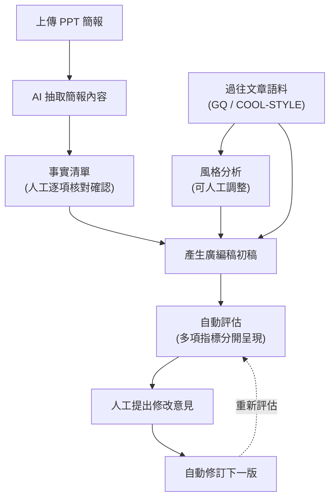

# 廣編稿生成系統 — 報告第一版

> 日期：2026-07-27

---

## 一、專案總覽

這套系統的功能是：拿到一份行銷簡報（PPT），自動撰寫出模仿 **GQ** 或 **COOL-STYLE** 風格的廣編稿，並提供人工核對、修訂的完整操作介面。

目前已完成兩種生成模式的實作與實測比較：先做出一套較簡單快速的版本作為基礎，之後又開發了一套較完整的多階段流程（分段檢查、逐步生成），經比較後**多階段流程在完整度與可讀性上較佳，已設為系統預設**。另外兩項規劃中的進階功能（風格向量校正、根據修訂紀錄微調模型）依原計畫暫緩，待累積更多使用資料後再評估是否啟動。

---

## 二、核心設計與品質保障

| 項目 | 做法 | 目的 |
|---|---|---|
| 事實正確性 | 稿件中的品牌、型號、人名等資訊只能來自簡報內容，且需人工逐項核對確認後才可使用；系統會自動檢查稿件是否遺漏或竄改這些事實 | 避免生成內容捏造簡報沒有提到的資訊 |
| 抄襲防護 | 生成後自動比對稿件與參考範文的文字重疊程度，超過門檻會警示並標出來源 | 避免模仿風格演變成照抄已發表文章 |
| 風格指南可編輯 ⁴ | 每個媒體／作者的寫作風格會先分析統計數據（用詞、標點習慣、段落節奏等）並歸納成指南，指南在生成前可由人工直接調整 | 讓使用者能檢視並掌控 AI 對風格的判斷，而不是完全黑箱 |
| 多面向評估，不給單一總分 ³ | 每篇稿件會分別呈現風格相似度、抄襲風險、事實覆蓋率、內容評語等指標 | 單一總分容易掩蓋問題；分開呈現才能知道稿件具體弱在哪裡 |
| 保留人工修訂迴圈 ⁵ | 初稿產出並評估後，可將修改意見送回系統自動修訂，並記錄每一輪修改前後的內容 | 目前的自動化程度尚無法一次到位，修訂迴圈是刻意保留、而非未完成 |
| 資料處理採本地運算 | 語料的向量化分析在本地端 GPU 執行，不依賴外部服務的請求額度限制 | 避免受制於第三方服務的用量上限，處理速度也更快更穩定 |

---

## 三、系統運作流程

**兩種生成模式**：

| 模式 | 說明 | 耗時 |
|---|---|---|
| 快速模式 | 一次生成完整稿件 | 約 30 秒 |
| **完整模式 ★目前預設** ¹ | 分階段進行（找範文→篩選→大綱→正文），過程中可人工檢查方向是否正確 | 約 80 秒 |

修訂功能預設會自動進行一輪修改，若修改後品質沒有進一步提升就會停止，不會無限重寫浪費時間。

---

## 四、實驗驗證成果

系統開發過程中針對幾個關鍵問題做了實測，而非憑經驗假設，重點結論與數據如下（各指標皆為 0–1 或 1–5 分區間，數值僅供橫向比較，非絕對品質分數）：

### 4.1 依主題挑選參考範文，是否讓文章更像該媒體的風格？ ²

| 指標 | 依主題挑選 | 隨機挑選 | 判讀 |
|---|---|---|---|
| 風格相似度 | 0.658 | 0.665 | 幾乎相同 |
| 與範文的貼合度 | 0.841 | 0.597 | 差距大——確認挑選機制本身有效 |
| 抄襲重疊率 | 0.003 | 0.010 | 兩者皆極低，依主題挑選並未升高抄襲風險 |
| 事實覆蓋率 | 1.00 | 0.90 | 依主題挑選三次全中 |
| 綜合評分 | 2.89 | 2.94 | 幾乎相同 |

結論：目前看不出明顯風格優勢，但也證實了挑選範文時不會把範文裡的其他事實誤植進稿件。

> 此為初期 12 篇的小規模測試。後續擴大到 81 篇並加入「完全不放範文」這個選項重測，
> 結論更明確——見 4.7。

### 4.2 兩種生成模式該用哪個？ ¹

| 項目 | 快速模式 | 完整模式 | 差異 |
|---|---|---|---|
| 標題貼合度 | 4.00 | 4.00 | 持平 |
| 語氣貼合度 | 3.00 | 3.00 | 持平 |
| 節奏貼合度 | 3.00 | 3.00 | 持平 |
| 用詞貼合度 | 3.00 | 3.00 | 持平 |
| 內容完整度 | 2.00 | 2.75 | 完整模式較佳 |
| 讀起來像人寫 | 2.25 | 2.75 | 完整模式較佳 |
| 事實覆蓋率 | 1.00 | 1.00 | 持平 |
| 平均耗時 | 29 秒 | 83 秒 | 完整模式慢 2.9 倍 |

結論：完整模式在內容完整度與可讀性上較佳，人工閱讀比較後也認同，因此已設為預設；耗時代價需權衡（見第五節問題一）。

### 4.3 不同檔期／題材的簡報，系統表現是否穩定？

| 簡報 | 事實覆蓋率 | 抄襲重疊率 | 風格相似度 | 內容完整度 |
|---|---|---|---|---|
| 檔期一 | 1.00 | 0.0007 | 0.664 | 2 |
| 檔期二 | 1.00 | 0.0006 | 0.692 | 2 |
| 檔期三 | 1.00 | 0.0018 | 0.621 | 2 |
| 檔期四 | 1.00 | 0.0000 | 0.679 | 2 |

結論：事實正確性與抄襲防護在不同題材下都穩定維持在高標準；但內容完整度全數落在 2 分，代表初稿普遍缺少售價、通路等落地資訊，需要靠修訂補齊——這也是修訂流程被保留為必要步驟的原因。

### 4.4 修訂要重複幾次？

| 重寫次數 | 修改被採納比例 | 綜合評分 | 事實覆蓋率 | 耗時 |
|---|---|---|---|---|
| 0（不修訂） | — | 3.06 | 1.00 | 93 秒 |
| 1 次 | 100% | 3.28 | 1.00 | 147 秒 |
| 2 次 | 30% | 3.22 | 1.00 | 158 秒 |
| 3 次 | 100% | 3.33 | 1.00 | 177 秒 |

結論：第 2 輪修訂從未帶來進一步提升，因此系統預設只自動修訂 1 次，避免多花時間卻沒有效果。

### 4.5 不同作者的寫作風格是否可以分開模仿？

COOL-STYLE 少數幾位作者長期供稿，適合做個人風格模仿；GQ 作者眾多且風格差異大（同一數據上作者間 emoji 使用習慣相差可達 13 倍），若指定模仿整個媒體、不分作者，結果會是失真的「平均風格」，建議模仿 GQ 時指定特定作者。

### 4.6 風格指南的取樣方式（用多少篇文章、怎麼挑選）

| 取樣方式 | 綜合評分 | 風格相似度 | 用詞／標點偏離程度（越低越好） |
|---|---|---|---|
| 原始做法（24 篇，簡單隨機） | 3.17 | 0.674 | 3.3（最佳） |
| 加大樣本（40 篇，簡單隨機） | 3.06 | 0.656 | 4.0 |
| 分層抽樣（24 篇） | 2.94 | 0.656 | 4.3 |
| 分層抽樣＋加大樣本（40 篇） | 3.22 | 0.664 | 5.0（最差） |

結論：原本簡單的做法效果最好，加大樣本、改用更複雜的分層抽樣反而使結果變差，因此維持原本做法不變。

### 4.7 參考範文到底有沒有幫助？（規模最大的一次驗證）

前面 4.1 只比較了「依主題挑選」與「隨機挑選」，兩者都有放範文。這次把**完全不放範文**也納入比較，並把樣本從 12 篇擴大到 **81 篇**，涵蓋 4 份不同檔期的簡報與 5 位不同作者的風格。

| 挑選方式 | 篇數 | 綜合評分 | 風格相似度 | 抄襲重疊率 | 用詞／標點偏離（越低越好） | 平均耗時 | 事實覆蓋率 |
|---|---|---|---|---|---|---|---|
| 依主題挑選範文 | 27 | 3.27 | 0.6468 | 0.0022 | 4.3 | 111 秒 | 1.00 |
| **依主題挑選後再篩代表性 ★目前預設** | 27 | **3.29** | 0.6469 | 0.0021 | 4.2 | 93 秒 | 1.00 |
| 完全不放範文 | 27 | 3.28 | **0.6482** | **0.0000** | **4.0** | **84 秒** | 1.00 |

**81 篇稿件的綜合評分全距只有 0.02 分，風格相似度全距 0.0014。**

兩種情境各自獨立測試，方向一致：

| 測試情境 | 依主題挑選 | 挑選後再篩代表性 | 完全不放範文 |
|---|---|---|---|
| 跨 4 份不同檔期簡報（每組 12 篇） | 3.28 | 3.28 | **3.29** |
| 跨 5 位不同作者風格（每組 15 篇） | 3.26 | **3.30** | 3.27 |

「跨作者」原本是最可能出現差異的情境——個別作者的寫作習慣比整個媒體的平均更具體，參考範文理論上最該派上用場。結果同樣分不出差別。

**值得留意的一點**：81 篇中抄襲重疊率最高的一筆（0.0111）出現在「依主題挑選範文」組。雖然離警示門檻還很遠，但那是唯一一組重疊率不可忽略的；「不放範文」因為沒有範文可參照，重疊率必然是零。

**結論**：三種做法的成品品質分不出差別。放範文唯一穩定產生的效果是抄襲風險與額外耗時，而非品質提升。合理的解釋是：**風格指南已經把「該怎麼寫」交代完整了**（標題公式、開場方式、標點習慣、慣用詞彙都寫在裡面），再附幾篇範文並沒有補充到新資訊。

依數據，「完全不放範文」有品質相當、無抄襲可能、快約兩成的優勢；目前系統仍維持「依主題挑選後再篩代表性」為預設，此選擇記錄在此以便日後回頭檢視。使用者可在產稿頁自行切換這三個選項。

> 附帶說明：語料庫本身**不受影響**。風格指南是從 46,153 篇語料歸納出來的，
> 風格相似度指標也需要語料作為比較基準。這項結論只涉及「產稿當下要不要再附幾篇範文」。

---

## 五、需要您協助判斷的問題

自動化的量測已經到了極限，以下兩點需要您實際看過稿件後給意見，而非技術問題：

1. **完整模式比快速模式好，但耗時多出近 3 倍，這個差距對實際交稿品質重不重要？** 建議實際挑一篇快速模式、一篇完整模式的稿件比較，看您比較願意採用哪一篇。
2. **參考範文在數據上看不出貢獻（見 4.7），但那是機器判讀的結果。** 若您實際閱讀後認為有放範文的稿件確實比較好，代表現行的評估指標不夠敏銳，那會是比數據更重要的資訊。
3. **目前尚未累積人工評分**。這是唯一能確認自動化指標判斷是否準確的方法，建議您實際使用系統一段時間後，對稿件品質給予評分回饋。

---

## 六、參考文獻

系統的部分設計決策參考了下列已發表研究，而非僅憑經驗判斷：

1. arXiv:2308.07968 — 多階段生成管線（檢索→重排→摘要→大綱→生成）的設計依據，本系統的「完整模式」即依此架構實作並實測驗證有效。
2. arXiv:2509.14543 — 該研究發現依主題相似度挑選範例反而可能降低風格辨識度，與一般認知相反。本系統因此把「挑選範文的方式」設計成可測試切換的變因，而非直接預設何者正確，並用自己的語料實測（見第四節）。
3. arXiv:2508.06374 — 比較多種風格評估方法後發現，任何單一指標都不夠可靠，唯有指標組合較準。本系統據此不提供單一總分，而是分項呈現多項指標。
4. arXiv:2402.08855（GhostWriter）— 指出好的人機協作寫作系統，關鍵在於讓使用者能檢視並掌控 AI 的風格判斷，而非一味追求自動化程度。本系統風格指南因此設計為可人工編輯。
5. arXiv:2506.17863（MarketingFM，KDD 2025）— 目前查到與本專案最相近的產業案例，論文同樣強調即使有自動化審核機制，人工仍須負責設定門檻與最終核可。本系統保留人工修訂迴圈的設計與此一致。
