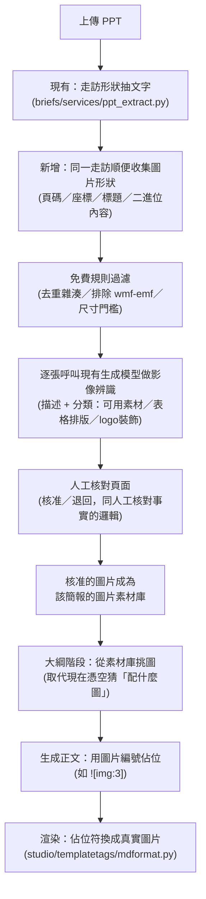

# PPT 圖片解析 — 制定計畫

> 動機：目前生成的廣編稿在需要放圖的地方只寫文字佔位（`（Photo from 品牌名）`），
> 由人工事後自己去簡報裡找圖、排版。使用者提出的構想：解析 PPT 時順便把圖片也抽出來，
> 依頁數／標題／座標／周邊文字標記，並用影像辨識判斷這張圖能不能用，
> 最後生成廣編稿時直接把核准的圖插進正文。
>
> 本文件先驗證構想是否可行，再給出具體技術方案。**驗證用的是這份專案裡真實已上傳的簡報**
> （`0804_NB_Oct_Campaign_Media_Proposal_Final.pptx`），不是憑空假設。
>
> **狀態：已實作完成（2026-07-27）**，Phase 0–2 全部上線。實作過程中的兩項修正見第十節。

---

## 一、現況：為什麼現在只有文字佔位

`studio/services/prompts.py` 的輸出格式明確要求模型「不要描述那張圖要拍什麼」，
只寫來源標註。這是刻意的：系統目前完全沒有圖片素材可用，讓模型憑空描述「這裡應該放一張
XX 的照片」只會產生沒人核對過的想像內容，還不如留白讓人工自己找圖安全。

也就是說，**現在的限制不是設計上不想做，而是解析階段本來就沒有把圖片留下來**。這正是這次
構想要補的洞。

---

## 二、可行性驗證（實測，非推測）

針對使用者提出的三個子問題，各自實測驗證：

### 2.1 解析 PPT 時能不能順便把圖片抽出來，並拿到頁數／座標？ ¹

**可以，而且不需要換函式庫。** 現有的 `briefs/services/ppt_extract.py` 已經在用
`python-pptx` 走訪每張投影片的所有形狀（含群組展開）來抓文字；同一個走訪迴圈里，
圖片形狀（`shape.shape_type == PICTURE`）本來就會被路過，只是目前直接跳過。

用這份真實簡報實測：

```
總圖片數：211（分布在 25 張投影片）
每張圖都能拿到：投影片頁碼、形狀座標(left/top/width/height)、圖片二進位內容、副檔名
```

### 2.2 能不能依頁數、標題、座標、周邊文字標記？ ²

**頁碼可以直接拿到，座標可以直接拿到，標題可以直接拿到**（`slide.shapes.title`）。
「周邊文字」則只能做到**近似**，需要說清楚限制：

- PPT 檔案格式**不記錄「這段文字是在描述哪張圖」**，只記錄每個形狀各自的座標。
- 能做的是「同一張投影片上，找座標離這張圖片最近的文字框」當作候選周邊文字，
  這是空間推測，不是簡報作者的原始意圖——標題投影片、文字滿版的投影片都可能推測錯。
  這與文獻中「以邊界框最近距離配對圖與其說明文字」的通用做法一致，
  差別只在於學術文獻處理的是排版較規整的論文 PDF，簡報排版變化更大，誤判機率更高。
- 因此周邊文字只能當**輔助線索**餵給下一步的影像辨識／人工核對，不能當成可靠的真相。
  若日後準確度不夠，文獻上有更進階的做法是**同時比對版面座標與文字內容的語意關聯** ³，
  而不只靠座標距離，可作為 Phase 3 之後的加強方向。

### 2.3 影像辨識能不能判斷圖片可不可用？辨識能不能呼叫 API？ ⁴

**可以，而且不需要另外申請影像辨識服務。** 系統現有的生成模型（`.env` 設定的 `gpt-5.4`，
走 Azure 的 OpenAI 相容 Responses API）本身就是多模態模型，`core/llm.py` 目前的
`client.responses.create()` 呼叫方式只要把 `input` 換成含圖片的內容陣列即可，
是同一支 API、同一把金鑰、同一個 `core/llm.py` 抽換層，不需要新增依賴或申請新服務。

**實測**：從這份簡報抽出檔案最大的一張圖（231KB 的 jpg），直接送進 `gpt-5.4`，
請它用一句話描述並三選一分類（產品／人物照片、表格／排版素材、logo／裝飾圖案）：

> 輸入：兩雙鞋子的產品情境照
> 模型回覆：`{"description":"兩雙運動鞋以甜點風格擺拍在草莓奶油蛋糕與糖粒裝飾周圍的產品照片。","category":"a"}`

判斷正確。三個子問題全部驗證可行。

### 2.4 意外發現：免費的前置過濾比想像中有效

實測同時發現一件對成本規劃很重要的事：**211 張圖片裡，用內容雜湊（content hash）去重後只剩
151 張不重複的**，而且同一個 46,600 bytes 的 `.wmf` 檔案（品牌 logo）**原封不動出現在 8 張以上
的投影片裡**——這是每次都放在同一位置的樣板浮水印，不是內容。

這代表在花錢呼叫影像辨識之前，有一層**完全免費**的規則過濾可以先擋掉一大半無意義的圖 ⁵：

| 過濾規則 | 依據 |
|---|---|
| 內容雜湊重複出現（同一張圖在多張投影片重複） | 樣板 logo／浮水印的典型特徵 |
| 副檔名為 `.wmf` / `.emf`（向量圖檔） | PowerPoint 內建圖案／舊版 logo 常見格式，**且這類格式無法直接送進影像辨識 API**（API 吃的是點陣圖 png/jpg/gif），必須排除或另外轉檔 |
| 檔案體積過小（如 <20KB）或面積過小 | 通常是圖示、分隔線、裝飾元素，不是照片 |

只有通過這層免費過濾的圖，才值得花一次影像辨識呼叫去判斷。

這裡用的內容雜湊只抓得到位元組完全相同的重複；同一張圖若被重新壓縮或縮放過，雜湊值就會
不同而漏網。3.2 節據此把過濾階段設計成兩層，額外加上感知雜湊來抓這類近似重複。

---

## 三、技術方案設計



### 3.1 抽取階段（擴充，不是重寫）

在 `ppt_extract.py` 既有的 `walk(shapes)` 遞迴裡，新增一個分支：遇到
`shape.shape_type == PICTURE` 時，記錄 `(slide_index, shape.left, shape.top,
shape.width, shape.height, shape.image.blob, shape.image.ext, 該投影片標題)`，
與現有文字抽取共用同一次走訪，不需要重新解析檔案。

### 3.2 過濾階段（免費，見 2.4）

依序套用四道規則，全部在本機運算、不呼叫任何 API，是控制影像辨識成本的第一道關卡：

1. **精確雜湊去重**：對每張圖的原始位元組算 MD5，同一份簡報內雜湊完全相同者視為同一張圖
   （本次實測 211 張圖靠這一步就先篩掉 60 張）。這一步只抓得到「位元組完全一致」的重複，
   例如同一張圖被複製貼上到多張投影片、完全沒有經過任何處理的情形。
2. **感知雜湊去重（新增）** ⁵：精確雜湊抓不到「同一張圖但被重新壓縮、縮放，或存成不同格式」
   的重複——這在簡報樣板裡很常見（例如 logo 在不同投影片被拉伸成不同尺寸貼上）。做法是對每張
   通過步驟 1 的圖計算感知雜湊（如 dHash／pHash，可用 Python `imagehash` 套件，內部先縮成
   固定小尺寸灰階圖再取差異或頻域特徵），兩張圖的感知雜湊之間算漢明距離（Hamming distance），
   低於門檻（初期建議 ≤5，日後依實測樣本調整）就視為同一素材的變體，只保留其中畫質最好的一張
   進入後續判斷。這一步是精確雜湊之外的第二層防護，兩者互補而非取代。
3. **排除向量圖檔格式**：`.wmf` / `.emf` 這類向量圖檔本身無法送進影像辨識 API，直接濾除。
4. **尺寸／體積門檻**：檔案體積或像素面積過小（如 <20KB）的圖，通常是圖示、分隔線、裝飾元素。

四道規則跑完才進入下一步真正花錢的影像辨識，只對「唯一且够大」的候選圖呼叫模型。

### 3.3 影像辨識階段（呼叫現有模型，非新服務）

對通過過濾的每張圖，呼叫 `gpt-5.4`（多模態），輸入圖片＋同投影片的鄰近文字線索 ⁸，
請它輸出：

- 一句話描述（給人工核對用，不是給讀者看的文案）
- 分類：可用素材（產品／人物／場景照片）／表格或排版類（簡報用，不適合放進文章）／
  logo或裝飾圖案（濾掉）
- 建議的圖說一句話（可作為「（Photo from XXX）」佔位文字的起點，人工可改）

### 3.4 人工核對階段 ⁹

比照現有「AI 抽取事實 → 人工逐項核對」的既有模式：新增一個「圖片素材」分頁，
以縮圖＋AI 描述＋分類的列表呈現，人工可以核准／退回，也可以把 AI 判斷成「表格」但
其實是產品照的圖手動改判。**不新增一套核對邏輯，沿用現有簡報確認流程的介面模式**。

### 3.5 生成整合階段 ⁶ ⁷

方案 B（多階段管線）的大綱階段目前已經會問「這段是否需要配圖、配什麼」，只是答案目前
是模型憑空想像的文字描述。有了真實圖片素材庫後，這一步改成**從核准的素材庫裡挑**，
大綱輸出圖片編號而不是想像描述；正文生成時模型用 `![img:編號]` 這種佔位語法標記位置；
`studio/templatetags/mdformat.py` 的 `article` 渲染器新增一個規則，把 `![img:N]` 換成
指向該圖片檔案的 `` 標籤。方案 A（單次生成）可以先不接這個功能，等方案 B 驗證過再看
要不要補上——避免兩套生成路徑同時改動出錯的風險。

---

## 四、資料模型變動

新增 `briefs.BriefImage`（比照 `Brief` 現有的一對多關聯設計）：

| 欄位 | 用途 |
|---|---|
| `brief`（外鍵） | 屬於哪份簡報 |
| `slide_index` | 第幾張投影片 |
| `image_hash` | 精確內容雜湊（MD5），抓完全相同位元組的重複 |
| `phash` | 感知雜湊，抓經過壓縮／縮放的近似重複素材（見 3.2 節） |
| `file` | 抽出的圖片檔案本體 |
| `slide_heading` | 該投影片的標題（若有） |
| `nearby_text` | 空間上最接近的文字線索（明確標註為推測，非精確關聯） |
| `ai_description` / `ai_category` | 影像辨識結果 |
| `approved` | 人工核對結果，`False` 的圖不會進入生成階段的素材庫 |

---

## 五、與現有設計原則的一致性

系統目前最核心的規則是「三層來源分離」——事實只能來自簡報 JSON、風格指南只管怎麼寫、
範例只管語感。圖片素材在這個框架裡的定位很清楚：**圖片跟文字事實一樣，來源是這份簡報本身**，
不是外部語料，所以不會產生「借了別人的圖」這種污染風險，可以直接視為 Brief 事實來源的延伸，
不需要額外設計一套新的授權規則。

唯一需要沿用的既有原則是「人工核對後才能用」——這與事實 JSON 必須先人工確認才能進生成
階段完全同一邏輯，只是核對的對象從文字換成圖片。

---

## 六、風險與限制

1. **周邊文字關聯只是空間推測**（見 2.2），核對介面必須讓人工看得到「AI 判斷的關聯線索」
   而不是直接把圖套用某段文字，避免誤植。
2. **向量圖檔（wmf/emf）無法直接送進影像辨識**，需要在過濾階段就排除，如果之後發現有
   簡報把重要商品圖存成向量格式（機率低，但需留意），才需要再評估是否加轉檔步驟。
3. **每份簡報多一次性成本**：影像辨識呼叫發生在「上傳簡報、抽取事實」階段，是每份簡報
   做一次，不是每次生成都要重跑，成本可控；且免費過濾（2.4）已經先擋掉多數不需要辨識的圖。
4. **版權**：圖片來自品牌方提供給代理商／媒體的簡報本身，与目前系統從外部語料庫檢索的
   文字範例性質不同（那些才是需要嚴格防抄襲的部分）；但如果簡報裡貼的是從網路截圖來的
   參考圖（而非品牌官方素材），仍需人工核對階段把關，不宜照單全收。
5. **表格／圖表類的分類準確度尚待更多樣本驗證**：這次測試抽到的候選圖以商品照為主，
   沒有實際測到「表格截圖」這類案例，正式上線前應找幾份含圖表的簡報再測一輪分類準確度。

---

## 七、分階段執行計畫

| 階段 | 內容 | 產出 |
|---|---|---|
| Phase 0 | `ppt_extract.py` 擴充圖片抽取；過濾規則採兩層去重——MD5 精確雜湊抓完全重複，`imagehash`（dHash／pHash，Hamming 距離門檻初定 ≤5）抓經壓縮／縮放的近似重複——再套用向量圖檔排除與尺寸門檻；先跑現有素材庫的簡報驗證各層過濾的效果 | 每份簡報的候選圖片清單（尚無 AI 判斷），含兩層去重後的實際篩除數字 |
| Phase 1 | 接上影像辨識呼叫，建立 `BriefImage` 資料模型與人工核對頁面 | 可核准／退回的圖片素材庫 |
| Phase 2 | 方案 B 大綱與生成階段接上素材庫，`mdformat.py` 支援圖片佔位符渲染 | 生成稿可直接顯示真實圖片，先只上線方案 B |
| Phase 3 | 用多份含圖表／複雜排版的簡報驗證分類準確度，視結果調整過濾門檻與分類 prompt；評估是否要讓方案 A 也支援 | 驗收報告 |

---

## 八、下一步待確認事項

- 圖片核對介面要獨立成一個分頁，還是併入現有的「簡報事實核對」頁面同一個畫面完成？
- 若同一品牌／代理商的簡報樣板重複使用（本次實測就發現同一份簡報裡 logo 重複 8 次以上），
  是否要做「跨簡報」的素材庫，讓核准過的 logo／固定版型圖片下次上傳同樣樣板時不用重新核對？
  （Phase 3 之後可視情況評估，非現階段必要）
- 影像辨識的分類是否需要比「三選一」更細（例如再拆出「KOL人像」「產品特寫」「場景氛圍」），
  細分後有助於大綱階段挑圖更精準，但也會增加人工核對時要看的欄位。

---

## 九、參考文獻

上網查證後，這個構想的每一個環節在學術文獻上都能找到對應的既有做法，不是憑空設計：

1. arXiv:2503.17710（Slide2Text）— 用 `python-pptx` 解析簡報的文字、版面配置與內嵌
   metadata 來做內容再利用，與 2.1 節「擴充現有 `ppt_extract.py` 走訪順便收圖」的做法
   路線一致，佐證這條技術路徑是成熟做法，不是本專案獨有的權宜之計。
2. arXiv:2601.00264（S1-MMAlign）與 arXiv:1804.02445（Extracting Scientific Figures with
   Distantly Supervised Neural Networks）— 兩者都用「邊界框最近距離」做圖片與說明文字的
   配對，是 2.2 節「同投影片內找座標最近文字框」這個空間推測做法的既有先例；文獻同樣
   提醒此法在複雜排版下會誤判，與本計畫把周邊文字列為「輔助線索、非可靠真相」的立場一致。
3. arXiv:2306.06306（DocumentCLIP）— 除了座標距離，額外用內容語意做圖文對齊，是 2.2 節
   提到「若準確度不夠可再加強」的具體方向，可作為 Phase 3 之後的升級選項。
4. arXiv:2509.22283（Rule-Based Reinforcement Learning for Document Image Classification
   with Vision Language Models）— 直接驗證用多模態模型對文件圖片做分類任務（如區分照片、
   表格等不同功能類別）是可行且已有研究基礎的做法，對應 2.3 節的核心假設。
5. arXiv:2108.11794（State of the Art: Image Hashing，感知雜湊技術綜述）— 支持 2.4 節
   用內容雜湊去除樣板重複圖片的做法；文獻中的**感知雜湊（perceptual hash）**能容忍些微
   壓縮或縮放差異，是比本次驗證所用的精確雜湊更強健的升級選項，可作為 Phase 0 的優化方向。
6. arXiv:1909.00692（Story-oriented Image Selection and Placement）— 同時解決「該選哪張圖」
   與「該放在文章哪個段落」兩個問題，是 3.5 節「從素材庫挑圖並用佔位符標記位置」設計的
   直接先例。
7. arXiv:2503.19065（WikiAutoGen）— 其生成流程包含「圖片位置提案→挑選→文章整合精修」
   的階段化設計，與本計畫「大綱階段挑圖→正文用佔位符標記→渲染時換成真實圖片」的分階段
   整合方式相呼應。
8. arXiv:2004.11449（Upgrading the Newsroom: An Automated Image Selection System for News
   Articles）— 用文章／段落的文字內容輔助判斷圖片是否適用，支持 3.3 節「連同鄰近文字線索
   一起送進影像辨識」的設計，而非只憑圖片本身判斷。
9. arXiv:2408.04331（Enhancing Journalism with AI: Contextualized Image Captioning for
   News Articles using LLMs and LMMs）— 該研究明確指出自動化的新聞圖說／配圖流程需要
   人機協作、不宜全自動，支持 3.4 節保留人工核對關卡的設計，而非讓 AI 判斷結果直接進稿。

---

## 十、實作結果與計畫的兩處修正（2026-07-27）

方案已實作完成並實測通過。實作時發現兩件計畫沒有預料到的事，都已修正：

### 10.1 ⚠ 競品照片：計畫漏掉的真實風險

第一次跑完整流程時，AI 把**第 4 張投影片的一雙 PUMA 粉紅色薄底鞋判定為「可用素材」**。
就影像辨識而言這個判斷沒有錯——那確實是一張乾淨的產品照。但這是提案簡報前段
拿來做市場分析的**競品商品**，若真的寫進 New Balance 的廣編稿，等於幫對手打廣告。

原計畫的三分類（可用／表格排版／裝飾）**在定義上抓不到這個問題**，因為它問的是
「這是什麼畫面」，而不是「這是誰的畫面」。

修法：把簡報事實裡的品牌名餵進辨識 prompt，並要求模型回報圖中辨識到的品牌。
分類標準改成「**{brand} 的**產品照才算可用，競品照一律歸表格排版類」。

修正後同一批 12 張圖的判定變化：

| 圖片 | 修正前 | 修正後 | 辨識到的品牌 |
|---|---|---|---|
| 粉紅薄底鞋 | ✅ 可用 | ❌ 排除 | PUMA |
| 咖啡托盤小物 | ✅ 可用 | ❌ 排除 | GUCCI |
| 四格拼貼小物 | ✅ 可用 | ❌ 排除 | Miu Miu |
| 社群貼文截圖 | ✅ 可用 | ❌ 排除 | adidas |
| 車內廣告螢幕 | ❌ 排除 | ❌ 排除 | Nike |
| NB 1000 銀黑款 | ✅ 可用 | ✅ 可用 | New Balance |
| NB × HAZUKIDO 聯名 | ✅ 可用 | ✅ 可用 | New Balance |

判定可用從 10 張降為 6 張，**濾掉的 4 張全部是競品或不相干品牌的商品照**。
這也再次印證第 3.4 節保留人工核對關卡的必要——自動判斷會漏，而且漏的方式很合理。

### 10.2 感知雜湊：自己實作而非引入套件

計畫原本寫用 `imagehash` 套件。實作時環境檢查發現該套件未安裝、但 Pillow 已在，
而 dHash 用 Pillow 寫出來只有十行。選擇直接實作，理由與本專案「不用向量資料庫」一致：
去重規則會直接影響哪些圖片進得了稿子，這種規則放在自己的程式碼裡看得見，
比藏在會隨版本更新而改變行為的套件裡好。`Pillow` 已列入 `requirements.txt`。

### 10.3 實測數據（同一份簡報）

| 項目 | 數字 |
|---|---|
| 簡報內嵌圖片總數 | **358**（遞迴展開群組後，比計畫階段的 211 更完整） |
| 過小濾除（<20KB） | 133 |
| 精確雜湊重複 | 37 |
| 向量圖檔（wmf/emf） | 26 |
| 感知雜湊近似重複 | 1 |
| **通過規則過濾** | **161** |
| 實際送辨識（取最大的 N 張） | 12（測試值；正式預設 40） |
| 判定可用 | 6 |

**免費規則先擋掉 55%**（358 → 161），而且完全不花 API 呼叫。
辨識階段以 6 執行緒並行，12 張耗時約 15 秒。

### 10.4 端到端驗證

以 COOL-STYLE 全站風格、方案 B 多階段管線實跑一次（run #219，耗時 105 秒）：

- 大綱階段確實從真實素材庫挑圖，不再憑空描述不存在的照片
- 正文用了 6 張中的 5 張，全部單獨成行放在段落之間
- 渲染後產出 5 個 `<figure>`，附圖說
- 刻意混入的錯誤編號 `[[img:99]]` 被靜默丟棄，未以原始標記外洩到頁面

### 10.5 與計畫的其他差異

- **佔位語法**改用 `[[img:N]]` 而非計畫寫的 `![img:N]`。原因：後者是 Markdown 圖片語法的
  半形，容易讓模型自行補上 `(url)` 而指向任意網址；`[[img:N]]` 沒有 Markdown 意義，
  編號只能對應到已核准清單，不可能指向外部資源。
- **圖片解析時機**：勾選框在上傳頁，但實際解析排在「抽取事實之後」才跑——
  分類需要知道品牌是誰（見 10.1），在抽事實前跑就擋不掉競品照。
  前台上傳會自動接續執行；後台因抽事實是獨立步驟，會在抽完後自動接著跑。
- **方案 A（單次生成）尚未接上**，與計畫 Phase 2 的規劃一致，避免兩條生成路徑同時改動。
